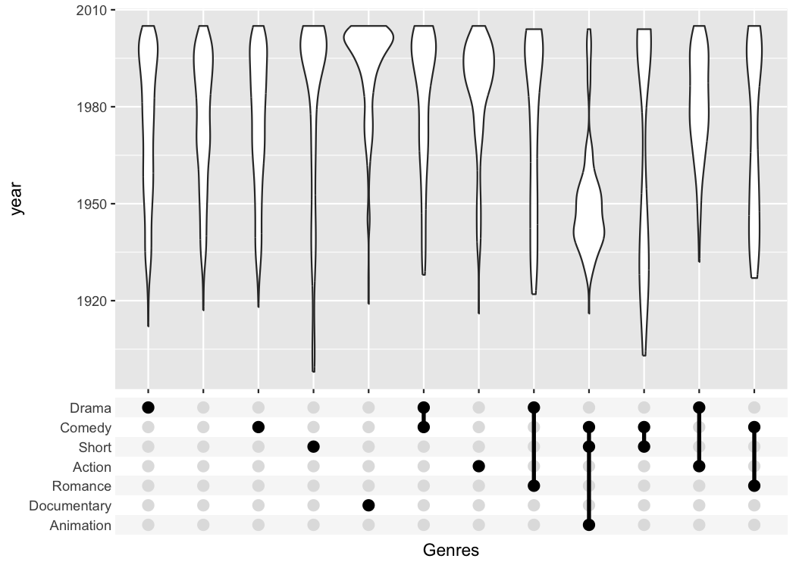

<!-- README.md is generated from README.Rmd. Please edit that file -->

```{r setup, include = FALSE}
knitr::opts_chunk$set(
  collapse = TRUE,
  comment = "#>",
  fig.path = "man/figures/README-",
  out.width = "70%",
  dpi = 150
  
)
set.seed(1)
```
# ggupset

Plot a combination matrix instead of the standard x-axis and create UpSet plots with ggplot2.



## Installation

You can install the released version of ggupset from [CRAN](https://cran.r-project.org/package=ggupset) with:

``` r
# Download package from CRAN
install.packages("ggupset")

# Or get the latest version directly from GitHub
devtools::install_github("const-ae/ggupset")
```

## Example

This is a basic example which shows you how to solve a common problem:

```{r example}
# Load helper packages
library(ggplot2)
library(tidyverse, warn.conflicts = FALSE)

# Load my package
library(ggupset)
```

In the following I will work with a tidy version of the movies dataset from
ggplot. It contains a list of all movies in IMDB, their release data and other
general information on the movie. It also includes a `list` column that contains
annotation to which genre a movie belongs (Action, Drama, Romance etc.)

```{r}
tidy_movies
```


`ggupset` makes it easy to get an immediate impression how many movies are in each
genre and their combination. For example there are slightly more than 1200 Dramas
in the set, more than 1000 which don't belong to any genre and ~170 that are Comedy
and Drama.

```{r}
tidy_movies %>%
  distinct(title, year, length, .keep_all=TRUE) %>%
  ggplot(aes(x=Genres)) +
    geom_bar() +
    scale_x_upset(n_intersections = 20)
```

## Adding Numbers on top

The best feature about `ggupset` is that it plays well with existing tricks from `ggplot2`. For example, you can easily add the size of the counts on top of the bars with this trick from [stackoverflow](https://stackoverflow.com/a/26556180/604854)

```{r}
tidy_movies %>%
  distinct(title, year, length, .keep_all=TRUE) %>%
  ggplot(aes(x=Genres)) +
    geom_bar() +
    geom_text(stat='count', aes(label=after_stat(count)), vjust=-1) +
    scale_x_upset(n_intersections = 20) +
    scale_y_continuous(breaks = NULL, lim = c(0, 1350), name = "")
```


## Reshaping quadratic data

Often enough the raw data you are starting with is not in such a neat tidy
shape. But that is a prerequisite to make such `ggupset` plots, so how can you get
from wide dataset to a useful one? And how to actually create a `list`-column, anyway?

Imagine we measured for a set of genes if they are a member of certain pathway. 
A gene can be a member of multiple pathways and we want to see which pathways
have a large overlap. Unfortunately, we didn't record the data in a tidy format
but as a simple matrix.

A ficitional dataset of this type is provided as `gene_pathway_membership` variable

```{r}
data("gene_pathway_membership")
gene_pathway_membership[, 1:7]
```


We will now turn first turn this matrix into a tidy tibble and then plot it

```{r}
tidy_pathway_member <- gene_pathway_membership %>%
  as_tibble(rownames = "Pathway") %>%
  gather(Gene, Member, -Pathway) %>%
  filter(Member) %>%
  select(- Member)

tidy_pathway_member
```

`tidy_pathway_member` is already a very good starting point for plotting with 
`ggplot`. But we care about the genes that are members of multiple pathways so
we will aggregate the data by `Gene` and create a `list`-column with the `Pathway`
information.

```{r}
tidy_pathway_member %>%
  group_by(Gene) %>%
  summarize(Pathways = list(Pathway))
```


```{r}
tidy_pathway_member %>%
  group_by(Gene) %>%
  summarize(Pathways = list(Pathway)) %>%
  ggplot(aes(x = Pathways)) +
    geom_bar() +
    scale_x_upset()
```


## What if I need more flexibility?

The first important idea is to realize that a list column is just as good as a character
vector with the list elements collapsed

```{r}
tidy_movies %>%
  distinct(title, year, length, .keep_all=TRUE) %>%
  mutate(Genres_collapsed = sapply(Genres, function(x) paste0(sort(x), collapse = "-"))) %>%
  select(title, Genres, Genres_collapsed)
```

We can easily make a plot using the strings as categorical axis labels

```{r}
tidy_movies %>%
  distinct(title, year, length, .keep_all=TRUE) %>%
  mutate(Genres_collapsed = sapply(Genres, function(x) paste0(sort(x), collapse = "-"))) %>%
  ggplot(aes(x=Genres_collapsed)) +
    geom_bar() +
    theme(axis.text.x = element_text(angle=90, hjust=1, vjust=0.5))
```

Because the process of collapsing list columns into delimited strings is fairly generic,
I provide a new scale that does this automatically (`scale_x_mergelist()`).

```{R}
tidy_movies %>%
  distinct(title, year, length, .keep_all=TRUE) %>%
  ggplot(aes(x=Genres)) +
    geom_bar() +
    scale_x_mergelist(sep = "-") +
    theme(axis.text.x = element_text(angle=90, hjust=1, vjust=0.5))
```

But the problem is that it can be difficult to read those labels.
Instead I provide a third function that replaces the axis labels
with a combination matrix (`axis_combmatrix()`).

```{R}
tidy_movies %>%
  distinct(title, year, length, .keep_all=TRUE) %>%
  ggplot(aes(x=Genres)) +
    geom_bar() +
    scale_x_mergelist(sep = "-") +
    axis_combmatrix(sep = "-")
```


One thing that is only possible with the `scale_x_upset()` function is to automatically order
the categories and genres by `freq` or by `degree`.

```{R}
tidy_movies %>%
  distinct(title, year, length, .keep_all=TRUE) %>%
  ggplot(aes(x=Genres)) +
    geom_bar() +
    scale_x_upset(order_by = "degree")
```


## Styling

To make publication ready plots, you often want to have complete control
how each part of a plot looks. This is why I provide an easy way to style
the combination matrix. Simply add a `theme_combmatrix()` to the plot.

```{r}
tidy_movies %>%
  distinct(title, year, length, .keep_all=TRUE) %>%
  ggplot(aes(x=Genres)) +
    geom_bar() +
    scale_x_upset(order_by = "degree") +
    theme_combmatrix(combmatrix.panel.point.color.fill = "green",
                     combmatrix.panel.line.size = 0,
                     combmatrix.label.make_space = FALSE)
```

## Maximum Flexibility

Sometimes the limited styling options using `combmatrix.panel.point.color.fill` are not enough. To fully customize the combination matrix plot, `axis_combmatrix` has an `override_plotting_function` parameter, that allows us to plot anything in place of the combination matrix.

Let us first reproduce the standard combination plot, but use the `override_plotting_function` parameter to see how it works:

```{r}
tidy_movies %>%
  distinct(title, year, length, .keep_all=TRUE) %>%
  ggplot(aes(x=Genres)) +
    geom_bar() +
    scale_x_mergelist(sep = "-") +
    axis_combmatrix(sep = "-", override_plotting_function = function(df){
      ggplot(df, aes(x= at, y= single_label)) +
        geom_rect(aes(fill= index %% 2 == 0), ymin=df$index-0.5, ymax=df$index+0.5, xmin=0, xmax=1) +
        geom_point(aes(color= observed), size = 3) +
        geom_line(data= function(dat) dat[dat$observed, ,drop=FALSE], aes(group = labels), size= 1.2) +
        ylab("") + xlab("") +
        scale_x_continuous(limits = c(0, 1), expand = c(0, 0)) +
        scale_fill_manual(values= c(`TRUE` = "white", `FALSE` = "#F7F7F7")) +
        scale_color_manual(values= c(`TRUE` = "black", `FALSE` = "#E0E0E0")) +
        guides(color="none", fill="none") +
        theme(
          panel.background = element_blank(),
          axis.text.x = element_blank(),
          axis.ticks.y = element_blank(),
          axis.ticks.length = unit(0, "pt"),
          axis.title.y = element_blank(),
          axis.title.x = element_blank(),
          axis.line = element_blank(),
          panel.border = element_blank()
        )
    })
```

We can use the above template, to specifically highlight for example all sets that include the _Action_ category.

```{r}
tidy_movies %>%
  distinct(title, year, length, .keep_all=TRUE) %>%
  ggplot(aes(x=Genres)) +
    geom_bar() +
    scale_x_mergelist(sep = "-") +
    axis_combmatrix(sep = "-", override_plotting_function = function(df){
      print(class(df))
      print(df)
      df %>%
        mutate(action_movie = case_when(
          ! observed ~ "not observed",
          map_lgl(labels_split, ~ "Action" %in% .x) ~ "Action",
          observed ~ "Non-Action"
        )) %>%
        ggplot(aes(x = at, y = single_label)) +
          geom_rect(aes(fill = index %% 2 == 0), ymin=df$index-0.5, ymax=df$index+0.5, xmin=0, xmax=1) +
          geom_point(aes(color = action_movie), size = 3) +
          geom_line(data= function(dat) dat[dat$observed, ,drop=FALSE], aes(group = labels, color = action_movie), size= 1.2) +
          ylab("") + xlab("") +
          scale_x_continuous(limits = c(0, 1), expand = c(0, 0)) +
          scale_fill_manual(values= c(`TRUE` = "white", `FALSE` = "#F7F7F7")) +
          scale_color_manual(values= c("Action" = "red", "Non-Action" = "black", "not observed" = "lightgrey")) +
          guides(fill="none") +
          theme(
            legend.position = "bottom",
            panel.background = element_blank(),
            axis.text.x = element_blank(),
            axis.ticks.y = element_blank(),
            axis.ticks.length = unit(0, "pt"),
            axis.title.y = element_blank(),
            axis.title.x = element_blank(),
            axis.line = element_blank(),
            panel.border = element_blank()
          )
    }) +
    theme(combmatrix.label.total_extra_spacing = unit(30, "pt"))
```

The `override_plotting_function` is incredibly powerful, but also an advanced feature that comes with pitfalls. Use at your own risk.

## Alternative Packages

There is already a package called `UpSetR` ([GitHub](https://github.com/hms-dbmi/UpSetR),
[CRAN](https://cran.r-project.org/package=UpSetR)) that provides very similar functionality
and that heavily inspired me to write this package.
It produces a similar plot with an additional view that shows the overall size
of each genre.

```{r}

# UpSetR
tidy_movies %>%
  distinct(title, year, length, .keep_all=TRUE) %>%
  unnest(cols = Genres) %>%
  mutate(GenreMember=1) %>%
  pivot_wider(names_from = Genres, values_from = GenreMember, values_fill = list(GenreMember = 0)) %>%
  as.data.frame() %>%
  UpSetR::upset(sets = c("Action", "Romance", "Short", "Comedy", "Drama"), keep.order = TRUE)

# ggupset
tidy_movies %>%
  distinct(title, year, length, .keep_all=TRUE) %>%
  ggplot(aes(x=Genres)) +
    geom_bar() +
    scale_x_upset(order_by = "degree", n_sets = 5)
```

The `UpSetR` package provides a lot convenient helpers around this kind of plot; the main
advantage of my package is that it can be combined with any kind of ggplot
that uses a categorical x-axis. This additional flexibility can be useful if
you want to create non-standard plots. The following plot for example shows
when movies of a certain genre were published.

```{r violinexample}
tidy_movies %>%
  distinct(title, year, length, .keep_all=TRUE) %>%
  ggplot(aes(x=Genres, y=year)) +
    geom_violin() +
    scale_x_upset(order_by = "freq", n_intersections = 12)
```


# Advanced examples

#### 1. Complex experimental design

The combination matrix axis can be used to show complex experimental designs,
where each sample got a combination of different treatments.

```{r}
df_complex_conditions

df_complex_conditions %>%
  mutate(Label = pmap(list(KO, DrugA, Timepoint), function(KO, DrugA, Timepoint){
    c(if(KO) "KO" else "WT", if(DrugA == "Yes") "Drug", paste0(Timepoint, "h"))
  })) %>%
  ggplot(aes(x=Label, y=response)) +
    geom_boxplot() +
    geom_jitter(aes(color=KO), width=0.1) +
    geom_smooth(method = "lm", aes(group = paste0(KO, "-", DrugA))) +
    scale_x_upset(order_by = "degree",
                  sets = c("KO", "WT", "Drug", "8h", "24h", "48h"),
                  position="top", name = "") +
    theme_combmatrix(combmatrix.label.text = element_text(size=12),
                     combmatrix.label.extra_spacing = 5)
```


#### 2. Aggregation of information

`dplyr` currently does not support list columns
as grouping variables. In that case it makes
sense to collapse it manually and use the
`axis_combmatrix()` function to get a good looking
plot.

```{r}
# Percentage of votes for n stars for top 12 genres
avg_rating <- tidy_movies %>%
  mutate(Genres_collapsed = sapply(Genres, function(x) paste0(sort(x), collapse="-"))) %>%
  mutate(Genres_collapsed = fct_lump(fct_infreq(as.factor(Genres_collapsed)), n=12)) %>%
  group_by(stars, Genres_collapsed) %>%
  summarize(percent_rating = sum(votes * percent_rating)) %>%
  group_by(Genres_collapsed) %>%
  mutate(percent_rating = percent_rating / sum(percent_rating)) %>%
  arrange(Genres_collapsed)

avg_rating

# Plot using the combination matrix axis
# the red lines indicate the average rating per genre
ggplot(avg_rating, aes(x=Genres_collapsed, y=stars, fill=percent_rating)) +
    geom_tile() +
    stat_summary_bin(aes(y=percent_rating * stars), fun = sum,  geom="point", 
                     shape="—", color="red", size=6) +
    axis_combmatrix(sep = "-", levels = c("Drama", "Comedy", "Short", 
                    "Documentary", "Action", "Romance", "Animation", "Other")) +
    scale_fill_viridis_c()

```

#### 3. Applied to summarised data

When we got summarized data like that, some data processing is required.

```{r}
tidy_movies_agg <- tidy_movies %>%
  distinct(title, year, length, .keep_all=TRUE) %>%
  group_by(Genres) %>% 
  summarise(count=n()) %>%
  arrange(desc(count)) %>%
  top_n(n=20, wt=count) 
tidy_movies_agg %>% 
  head()
```

To use `reorder()` and `axis_combmatrix()`, the genres column connected the list items by '-' and converted to factor from list. we get the same figure as displayed in the first example.

```{r}
tidy_movies_agg <- tidy_movies_agg %>% 
  mutate(Genres_str = sapply(Genres, function(x) paste0(sort(x), collapse="-"))) %>% 
  mutate(Genres_fct = factor(Genres_str))

tidy_movies_agg %>%
  ggplot(aes(x=reorder(Genres_fct, -count),y=count)) +
  geom_bar(stat = "identity") +
  axis_combmatrix(sep = "-",
                  levels = c("Drama", "Comedy", "Short", 
                             "Documentary", "Action", "Romance", "Animation", "Other"))
```


## Saving Plots

There is an important pitfall when trying to save a plot with a combination matrix.
When you use `ggsave()`, ggplot2 automatically saves the last plot that was created.
However, here `last_plot()` refers to only the combination matrix. To store the full
plot, you need to explicitly assign it to a variable and save that.
```{r warning=FALSE}
pl <- tidy_movies %>%
  distinct(title, year, length, .keep_all=TRUE) %>%
  ggplot(aes(x=Genres)) +
    geom_bar() +
    scale_x_upset(n_intersections = 20)
ggsave("/tmp/movie_genre_barchart.png", plot = pl)
```


## Session Info

```{r}
sessionInfo()
```


