<!-- README.md is generated from README.Rmd. Please edit that file -->

# ggupset

Plot a combination matrix instead of the standard x-axis and create
UpSet plots with ggplot2.

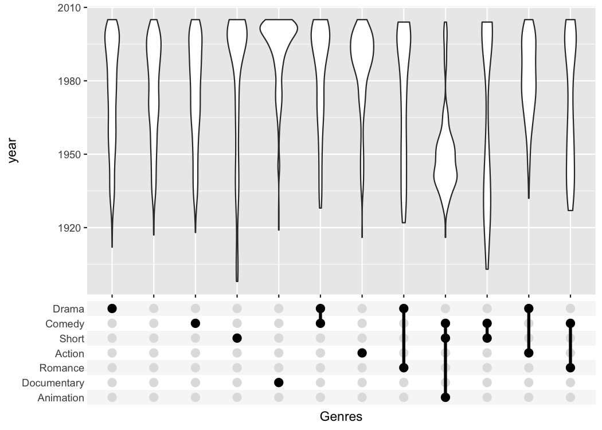

## Installation

You can install the released version of ggupset from
[CRAN](https://cran.r-project.org/package=ggupset) with:

``` r
# Download package from CRAN
install.packages("ggupset")

# Or get the latest version directly from GitHub
devtools::install_github("const-ae/ggupset")
```

## Example

This is a basic example which shows you how to solve a common problem:

``` r
# Load helper packages
library(ggplot2)
library(tidyverse, warn.conflicts = FALSE)
#> ── Attaching packages ──────────────────────────────────────────────────────────────────────────────────────────────────────────────────────────────────────────────────────────────────────────────────────────── tidyverse 1.3.0 ──
#> ✓ tibble  2.1.3     ✓ dplyr   0.8.4
#> ✓ tidyr   1.0.2     ✓ stringr 1.4.0
#> ✓ readr   1.3.1     ✓ forcats 0.4.0
#> ✓ purrr   0.3.3
#> ── Conflicts ─────────────────────────────────────────────────────────────────────────────────────────────────────────────────────────────────────────────────────────────────────────────────────────────── tidyverse_conflicts() ──
#> x dplyr::filter() masks stats::filter()
#> x dplyr::lag()    masks stats::lag()

# Load my package
library(ggupset)
```

In the following I will work with a tidy version of the movies dataset
from ggplot. It contains a list of all movies in IMDB, their release
data and other general information on the movie. It also includes a
`list` column that contains annotation to which genre a movie belongs
(Action, Drama, Romance etc.)

``` r
tidy_movies
#> # A tibble: 50,000 x 10
#>    title      year length  budget rating votes mpaa  Genres stars percent_rating
#>    <chr>     <int>  <int>   <int>  <dbl> <int> <chr> <list> <dbl>          <dbl>
#>  1 Ei ist e…  1993     90      NA    8.4    15 ""    <chr …     1            4.5
#>  2 Hamos st…  1985    109      NA    5.5    14 ""    <chr …     1            4.5
#>  3 Mind Ben…  1963     99      NA    6.4    54 ""    <chr …     1            0  
#>  4 Trop (pe…  1998    119      NA    4.5    20 ""    <chr …     1           24.5
#>  5 Crystani…  1995     85      NA    6.1    25 ""    <chr …     1            0  
#>  6 Totale!,…  1991    102      NA    6.3   210 ""    <chr …     1            4.5
#>  7 Visiblem…  1995    100      NA    4.6     7 ""    <chr …     1           24.5
#>  8 Pang she…  1976     85      NA    7.4     8 ""    <chr …     1            0  
#>  9 Not as a…  1955    135 2000000    6.6   223 ""    <chr …     1            4.5
#> 10 Autobiog…  1994     87      NA    7.4     5 ""    <chr …     1            0  
#> # … with 49,990 more rows
```

`ggupset` makes it easy to get an immediate impression how many movies
are in each genre and their combination. For example there are slightly
more than 1200 Dramas in the set, more than 1000 which don’t belong to
any genre and ~170 that are Comedy and Drama.

``` r
tidy_movies %>%
  distinct(title, year, length, .keep_all=TRUE) %>%
  ggplot(aes(x=Genres)) +
    geom_bar() +
    scale_x_upset(n_intersections = 20)
#> Warning: Removed 100 rows containing non-finite values (stat_count).
```

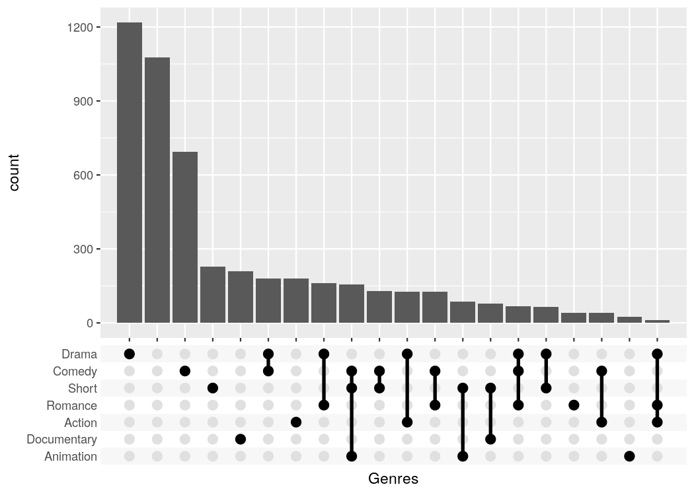

## Reshaping quadratic data

Often enough the raw data you are starting with is not in such a neat
tidy shape. But that is a prerequisite to make such `ggupset` plots, so
how can you get from wide dataset to a useful one? And how to actually
create a `list`-column, anyway?

Imagine we measured for a set of genes if they are a member of certain
pathway. A gene can be a member of multiple pathways and we want to see
which pathways have a large overlap. Unfortunately, we didn’t record the
data in a tidy format but as a simple matrix.

A ficitional dataset of this type is provided as
`gene_pathway_membership` variable

``` r
data("gene_pathway_membership")
gene_pathway_membership[, 1:7]
#>                                Aco1  Aco2  Aif1 Alox8   Amh Bmpr1b Cdc25a
#> Actin dependent Cell Motility FALSE FALSE FALSE FALSE FALSE  FALSE  FALSE
#> Chemokine Secretion            TRUE FALSE  TRUE  TRUE FALSE  FALSE  FALSE
#> Citric Acid Cycle              TRUE  TRUE FALSE FALSE FALSE  FALSE  FALSE
#> Mammalian Oogenesis           FALSE FALSE FALSE FALSE  TRUE   TRUE  FALSE
#> Meiotic Cell Cycle            FALSE FALSE FALSE FALSE FALSE  FALSE   TRUE
#> Neuronal Apoptosis            FALSE FALSE FALSE FALSE FALSE  FALSE  FALSE
```

We will now turn first turn this matrix into a tidy tibble and then plot
it

``` r
tidy_pathway_member <- gene_pathway_membership %>%
  as_tibble(rownames = "Pathway") %>%
  gather(Gene, Member, -Pathway) %>%
  filter(Member) %>%
  select(- Member)

tidy_pathway_member
#> # A tibble: 44 x 2
#>    Pathway             Gene  
#>    <chr>               <chr> 
#>  1 Chemokine Secretion Aco1  
#>  2 Citric Acid Cycle   Aco1  
#>  3 Citric Acid Cycle   Aco2  
#>  4 Chemokine Secretion Aif1  
#>  5 Chemokine Secretion Alox8 
#>  6 Mammalian Oogenesis Amh   
#>  7 Mammalian Oogenesis Bmpr1b
#>  8 Meiotic Cell Cycle  Cdc25a
#>  9 Meiotic Cell Cycle  Cdc25c
#> 10 Chemokine Secretion Chia1 
#> # … with 34 more rows
```

`tidy_pathway_member` is already a very good starting point for plotting
with `ggplot`. But we care about the genes that are members of multiple
pathways so we will aggregate the data by `Gene` and create a
`list`-column with the `Pathway` information.

``` r
tidy_pathway_member %>%
  group_by(Gene) %>%
  summarize(Pathways = list(Pathway))
#> # A tibble: 37 x 2
#>    Gene   Pathways 
#>    <chr>  <list>   
#>  1 Aco1   <chr [2]>
#>  2 Aco2   <chr [1]>
#>  3 Aif1   <chr [1]>
#>  4 Alox8  <chr [1]>
#>  5 Amh    <chr [1]>
#>  6 Bmpr1b <chr [1]>
#>  7 Cdc25a <chr [1]>
#>  8 Cdc25c <chr [1]>
#>  9 Chia1  <chr [1]>
#> 10 Csf1r  <chr [1]>
#> # … with 27 more rows
```

``` r
tidy_pathway_member %>%
  group_by(Gene) %>%
  summarize(Pathways = list(Pathway)) %>%
  ggplot(aes(x = Pathways)) +
    geom_bar() +
    scale_x_upset()
```

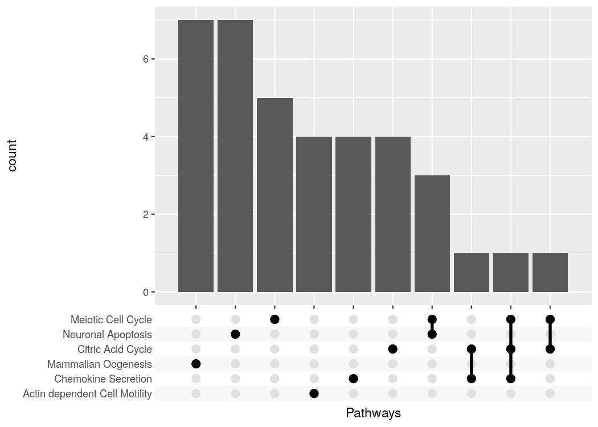

## What if I need more flexibility?

The first important idea is to realize that a list column is just as
good as a character vector with the list elements collapsed

``` r
tidy_movies %>%
  distinct(title, year, length, .keep_all=TRUE) %>%
  mutate(Genres_collapsed = sapply(Genres, function(x) paste0(sort(x), collapse = "-"))) %>%
  select(title, Genres, Genres_collapsed)
#> # A tibble: 5,000 x 3
#>    title                                   Genres    Genres_collapsed  
#>    <chr>                                   <list>    <chr>             
#>  1 Ei ist eine geschissene Gottesgabe, Das <chr [1]> "Documentary"     
#>  2 Hamos sto aigaio                        <chr [1]> "Comedy"          
#>  3 Mind Benders, The                       <chr [0]> ""                
#>  4 Trop (peu) d'amour                      <chr [0]> ""                
#>  5 Crystania no densetsu                   <chr [1]> "Animation"       
#>  6 Totale!, La                             <chr [1]> "Comedy"          
#>  7 Visiblement je vous aime                <chr [0]> ""                
#>  8 Pang shen feng                          <chr [2]> "Action-Animation"
#>  9 Not as a Stranger                       <chr [1]> "Drama"           
#> 10 Autobiographia Dimionit                 <chr [1]> "Drama"           
#> # … with 4,990 more rows
```

We can easily make a plot using the strings as categorical axis labels

``` r
tidy_movies %>%
  distinct(title, year, length, .keep_all=TRUE) %>%
  mutate(Genres_collapsed = sapply(Genres, function(x) paste0(sort(x), collapse = "-"))) %>%
  ggplot(aes(x=Genres_collapsed)) +
    geom_bar() +
    theme(axis.text.x = element_text(angle=90, hjust=1, vjust=0.5))
```

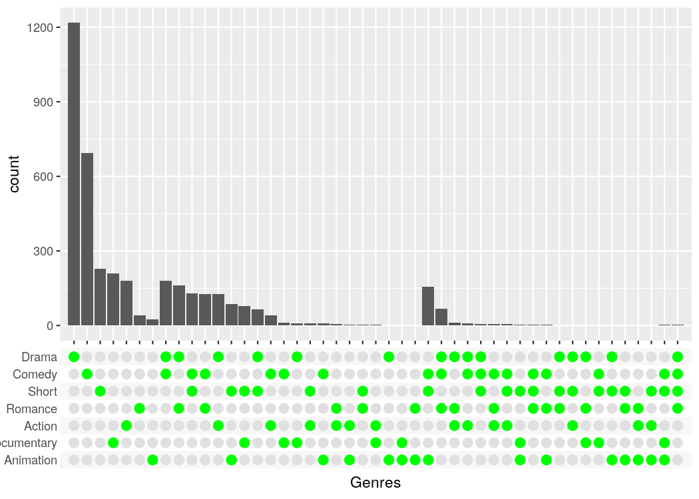

Because the process of collapsing list columns into delimited strings is
fairly generic, I provide a new scale that does this automatically
(`scale_x_mergelist()`).

``` r
tidy_movies %>%
  distinct(title, year, length, .keep_all=TRUE) %>%
  ggplot(aes(x=Genres)) +
    geom_bar() +
    scale_x_mergelist(sep = "-") +
    theme(axis.text.x = element_text(angle=90, hjust=1, vjust=0.5))
```

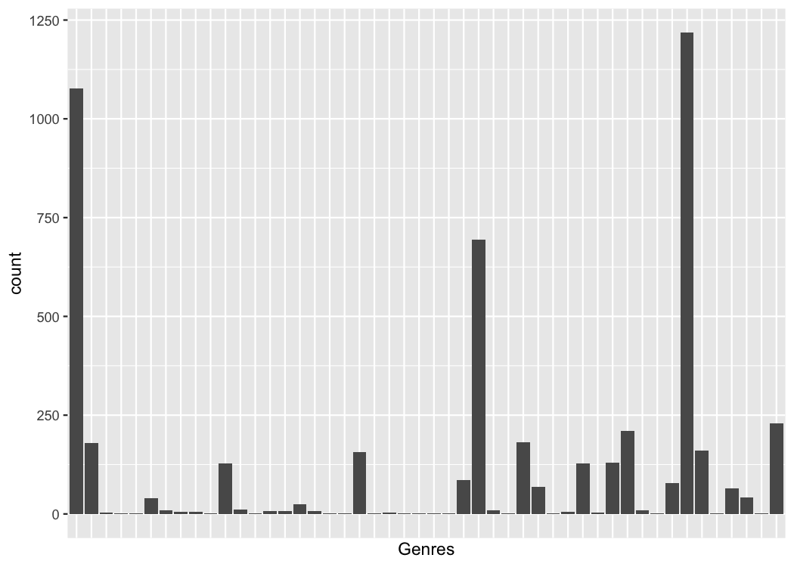

But the problem is that it can be difficult to read those labels.
Instead I provide a third function that replaces the axis labels with a
combination matrix (`axis_combmatrix()`).

``` r
tidy_movies %>%
  distinct(title, year, length, .keep_all=TRUE) %>%
  ggplot(aes(x=Genres)) +
    geom_bar() +
    scale_x_mergelist(sep = "-") +
    axis_combmatrix(sep = "-")
```

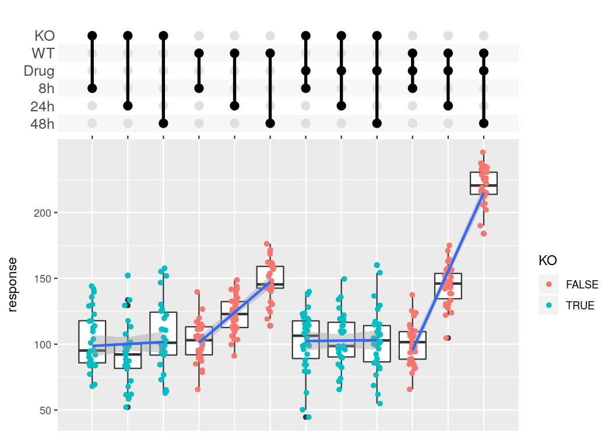

One thing that is only possible with the `scale_x_upset()` function is
to automatically order the categories and genres by `freq` or by
`degree`.

``` r
tidy_movies %>%
  distinct(title, year, length, .keep_all=TRUE) %>%
  ggplot(aes(x=Genres)) +
    geom_bar() +
    scale_x_upset(order_by = "degree")
#> Warning: Removed 1076 rows containing non-finite values (stat_count).
```

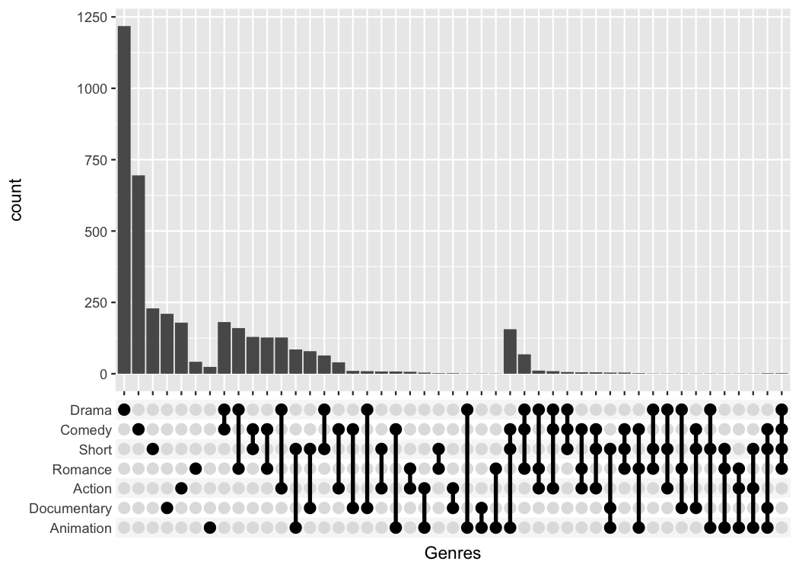

## Styling

To make publication ready plots, you often want to have complete control
how each part of a plot looks. This is why I provide an easy way to
style the combination matrix. Simply add a `theme_combmatrix()` to the
plot.

``` r
tidy_movies %>%
  distinct(title, year, length, .keep_all=TRUE) %>%
  ggplot(aes(x=Genres)) +
    geom_bar() +
    scale_x_upset(order_by = "degree") +
    theme_combmatrix(combmatrix.panel.point.color.fill = "green",
                     combmatrix.panel.line.size = 0,
                     combmatrix.label.make_space = FALSE)
#> Warning: Removed 1076 rows containing non-finite values (stat_count).
```


## Alternative Packages

There is already a package called `UpSetR`
([GitHub](https://github.com/hms-dbmi/UpSetR),
[CRAN](https://cran.r-project.org/package=UpSetR)) that provides very
similar functionality and that heavily inspired me to write this
package. It produces a similar plot with an additional view that shows
the overall size of each genre.

``` r

# UpSetR
tidy_movies %>%
  distinct(title, year, length, .keep_all=TRUE) %>%
  unnest(cols = Genres) %>%
  mutate(GenreMember=1) %>%
  pivot_wider(names_from = Genres, values_from = GenreMember, values_fill = list(GenreMember = 0)) %>%
  as.data.frame() %>%
  UpSetR::upset(sets = c("Action", "Romance", "Short", "Comedy", "Drama"), keep.order = TRUE)
```

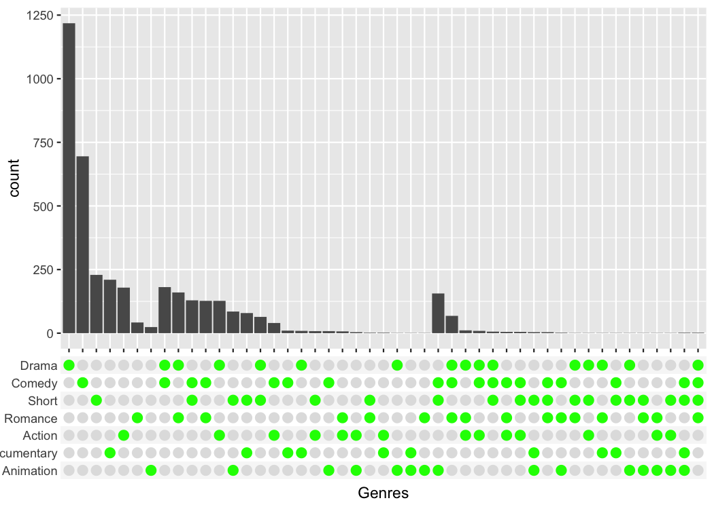

``` r

# ggupset
tidy_movies %>%
  distinct(title, year, length, .keep_all=TRUE) %>%
  ggplot(aes(x=Genres)) +
    geom_bar() +
    scale_x_upset(order_by = "degree", n_sets = 5)
#> Warning: Removed 1311 rows containing non-finite values (stat_count).
```

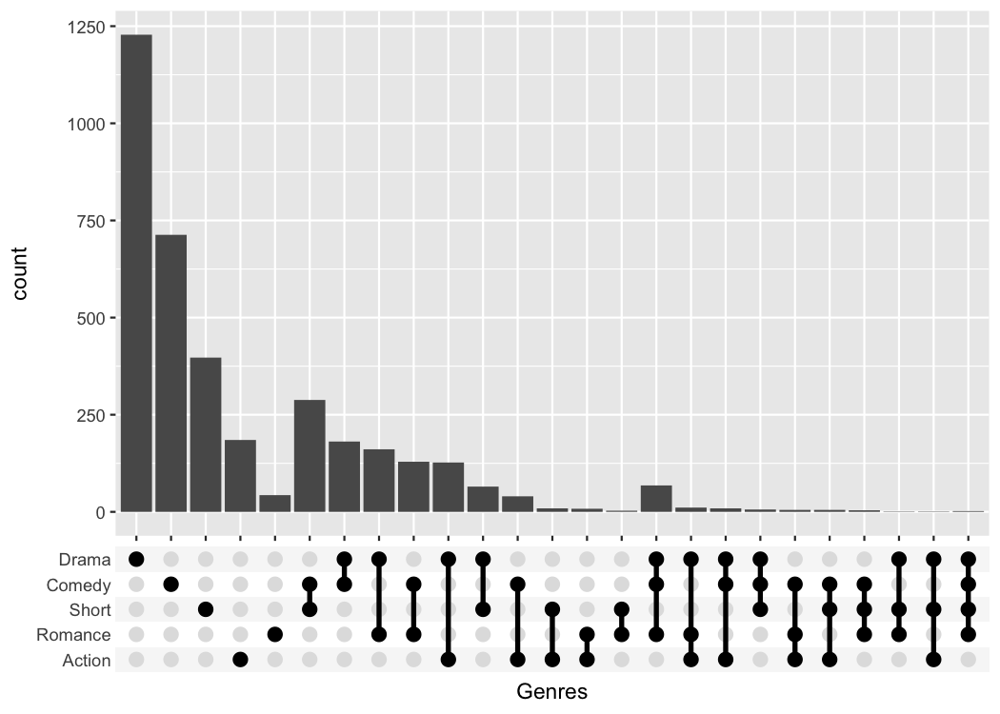

The `UpSetR` package provides a lot convenient helpers around this kind
of plot; the main advantage of my package is that it can be combined
with any kind of ggplot that uses a categorical x-axis. This additional
flexibility can be useful if you want to create non-standard plots. The
following plot for example shows when movies of a certain genre were
published.

``` r
tidy_movies %>%
  distinct(title, year, length, .keep_all=TRUE) %>%
  ggplot(aes(x=Genres, y=year)) +
    geom_violin() +
    scale_x_upset(order_by = "freq", n_intersections = 12)
#> Warning: Removed 513 rows containing non-finite values (stat_ydensity).
```


# Advanced examples

#### 1\. Complex experimental design

The combination matrix axis can be used to show complex experimental
designs, where each sample got a combination of different treatments.

``` r
df_complex_conditions
#> # A tibble: 360 x 4
#>    KO    DrugA Timepoint response
#>    <lgl> <chr>     <dbl>    <dbl>
#>  1 TRUE  Yes           8     84.3
#>  2 TRUE  Yes           8    105. 
#>  3 TRUE  Yes           8     79.1
#>  4 TRUE  Yes           8    140. 
#>  5 TRUE  Yes           8    108. 
#>  6 TRUE  Yes           8     79.5
#>  7 TRUE  Yes           8    112. 
#>  8 TRUE  Yes           8    118. 
#>  9 TRUE  Yes           8    114. 
#> 10 TRUE  Yes           8     92.4
#> # … with 350 more rows

df_complex_conditions %>%
  mutate(Label = pmap(list(KO, DrugA, Timepoint), function(KO, DrugA, Timepoint){
    c(if(KO) "KO" else "WT", if(DrugA == "Yes") "Drug", paste0(Timepoint, "h"))
  })) %>%
  ggplot(aes(x=Label, y=response)) +
    geom_boxplot() +
    geom_jitter(aes(color=KO), width=0.1) +
    geom_smooth(method = "lm", aes(group = paste0(KO, "-", DrugA))) +
    scale_x_upset(order_by = "degree",
                  sets = c("KO", "WT", "Drug", "8h", "24h", "48h"),
                  position="top", name = "") +
    theme_combmatrix(combmatrix.label.text = element_text(size=12),
                     combmatrix.label.extra_spacing = 5)
#> `geom_smooth()` using formula 'y ~ x'
#> Warning in munched_lines$id + rep(c(0, max(ids, na.rm = TRUE)), each =
#> length(ids)): longer object length is not a multiple of shorter object length

#> Warning in munched_lines$id + rep(c(0, max(ids, na.rm = TRUE)), each =
#> length(ids)): longer object length is not a multiple of shorter object length

#> Warning in munched_lines$id + rep(c(0, max(ids, na.rm = TRUE)), each =
#> length(ids)): longer object length is not a multiple of shorter object length

#> Warning in munched_lines$id + rep(c(0, max(ids, na.rm = TRUE)), each =
#> length(ids)): longer object length is not a multiple of shorter object length
```

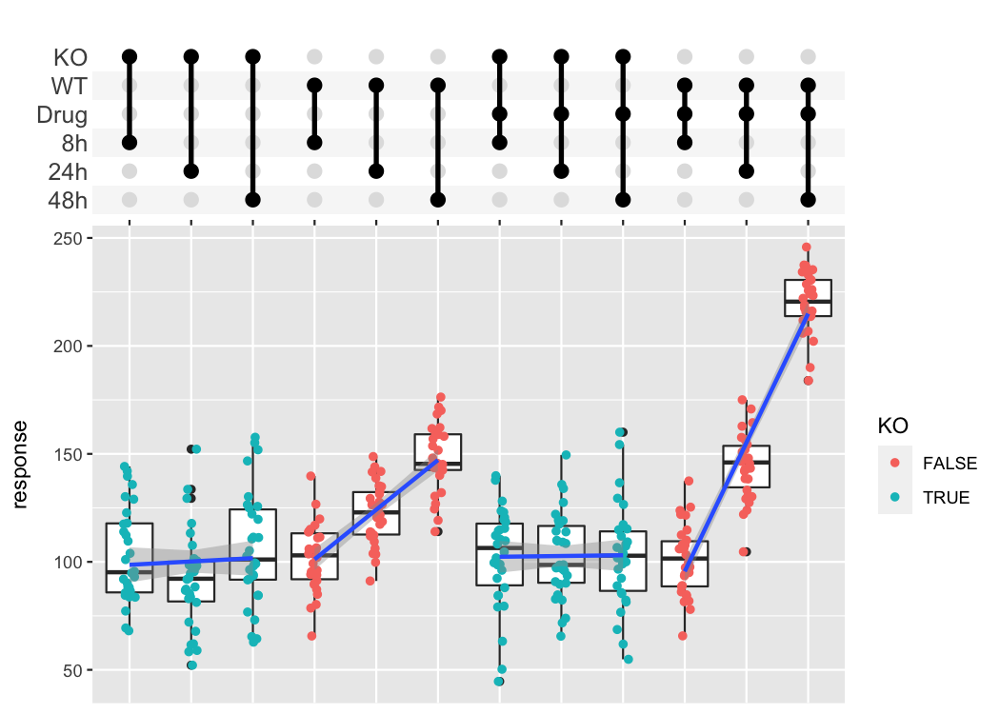

#### 2\. Aggregation of information

`dplyr` currently does not support list columns as grouping variables.
In that case it makes sense to collapse it manually and use the
`axis_combmatrix()` function to get a good looking plot.

``` r
# Percentage of votes for n stars for top 12 genres
avg_rating <- tidy_movies %>%
  mutate(Genres_collapsed = sapply(Genres, function(x) paste0(sort(x), collapse="-"))) %>%
  mutate(Genres_collapsed = fct_lump(fct_infreq(as.factor(Genres_collapsed)), n=12)) %>%
  group_by(stars, Genres_collapsed) %>%
  summarize(percent_rating = sum(votes * percent_rating)) %>%
  group_by(Genres_collapsed) %>%
  mutate(percent_rating = percent_rating / sum(percent_rating)) %>%
  arrange(Genres_collapsed)

avg_rating
#> # A tibble: 130 x 3
#> # Groups:   Genres_collapsed [13]
#>    stars Genres_collapsed percent_rating
#>    <dbl> <fct>                     <dbl>
#>  1     1 Drama                    0.0437
#>  2     2 Drama                    0.0411
#>  3     3 Drama                    0.0414
#>  4     4 Drama                    0.0433
#>  5     5 Drama                    0.0506
#>  6     6 Drama                    0.0717
#>  7     7 Drama                    0.129 
#>  8     8 Drama                    0.175 
#>  9     9 Drama                    0.170 
#> 10    10 Drama                    0.235 
#> # … with 120 more rows

# Plot using the combination matrix axis
# the red lines indicate the average rating per genre
ggplot(avg_rating, aes(x=Genres_collapsed, y=stars, fill=percent_rating)) +
    geom_tile() +
    stat_summary_bin(aes(y=percent_rating * stars), fun = sum,  geom="point", 
                     shape="—", color="red", size=6) +
    axis_combmatrix(sep = "-", levels = c("Drama", "Comedy", "Short", 
                    "Documentary", "Action", "Romance", "Animation", "Other")) +
    scale_fill_viridis_c()
```

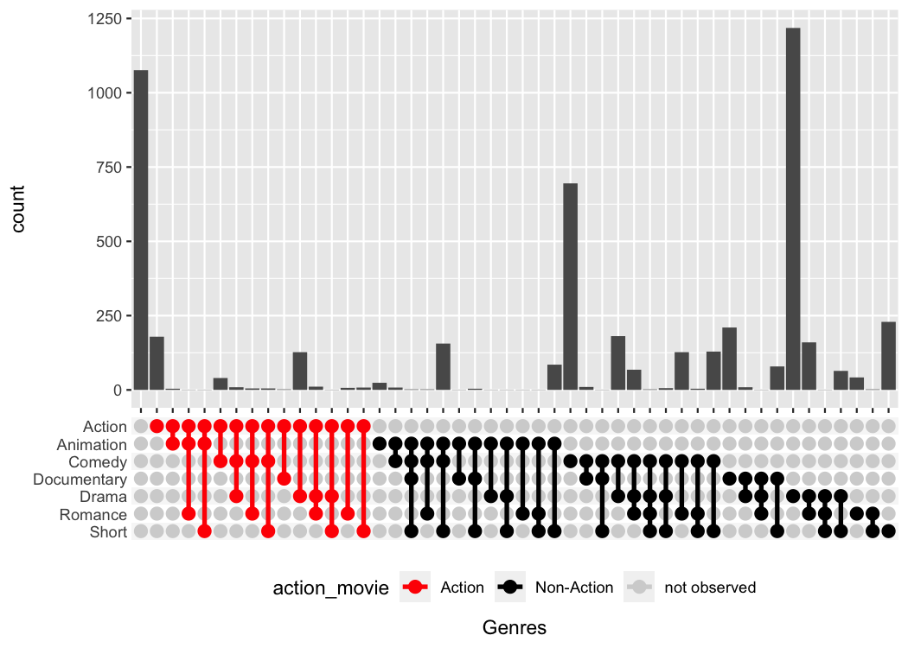

## Session Info

``` r
sessionInfo()
#> R version 3.6.2 (2019-12-12)
#> Platform: x86_64-apple-darwin15.6.0 (64-bit)
#> Running under: macOS Mojave 10.14.6
#> 
#> Matrix products: default
#> BLAS:   /Library/Frameworks/R.framework/Versions/3.6/Resources/lib/libRblas.0.dylib
#> LAPACK: /Library/Frameworks/R.framework/Versions/3.6/Resources/lib/libRlapack.dylib
#> 
#> locale:
#> [1] en_US.UTF-8/en_US.UTF-8/en_US.UTF-8/C/en_US.UTF-8/en_US.UTF-8
#> 
#> attached base packages:
#> [1] stats     graphics  grDevices utils     datasets  methods   base     
#> 
#> other attached packages:
#>  [1] ggupset_0.2.1   forcats_0.4.0   stringr_1.4.0   dplyr_0.8.4    
#>  [5] purrr_0.3.3     readr_1.3.1     tidyr_1.0.2     tibble_2.1.3   
#>  [9] tidyverse_1.3.0 ggplot2_3.3.0  
#> 
#> loaded via a namespace (and not attached):
#>  [1] Rcpp_1.0.3        lubridate_1.7.4   lattice_0.20-38   assertthat_0.2.1 
#>  [5] digest_0.6.23     utf8_1.1.4        R6_2.4.1          cellranger_1.1.0 
#>  [9] plyr_1.8.5        backports_1.1.5   reprex_0.3.0      evaluate_0.14    
#> [13] httr_1.4.1        pillar_1.4.3      rlang_0.4.4       readxl_1.3.1     
#> [17] rstudioapi_0.11   Matrix_1.2-18     rmarkdown_2.1     labeling_0.3     
#> [21] splines_3.6.2     munsell_0.5.0     broom_0.5.4       compiler_3.6.2   
#> [25] modelr_0.1.5      xfun_0.12         pkgconfig_2.0.3   mgcv_1.8-31      
#> [29] htmltools_0.4.0   tidyselect_1.0.0  gridExtra_2.3     fansi_0.4.1      
#> [33] viridisLite_0.3.0 crayon_1.3.4      dbplyr_1.4.2      withr_2.1.2      
#> [37] grid_3.6.2        nlme_3.1-142      jsonlite_1.6.1    gtable_0.3.0     
#> [41] lifecycle_0.1.0   DBI_1.1.0         magrittr_1.5      scales_1.1.0     
#> [45] cli_2.0.1         stringi_1.4.5     farver_2.0.3      fs_1.3.1         
#> [49] xml2_1.2.2        ellipsis_0.3.0    generics_0.0.2    vctrs_0.2.2      
#> [53] tools_3.6.2       glue_1.3.1        hms_0.5.3         yaml_2.2.1       
#> [57] colorspace_1.4-2  UpSetR_1.4.0      rvest_0.3.5       knitr_1.28       
#> [61] haven_2.2.0
```
