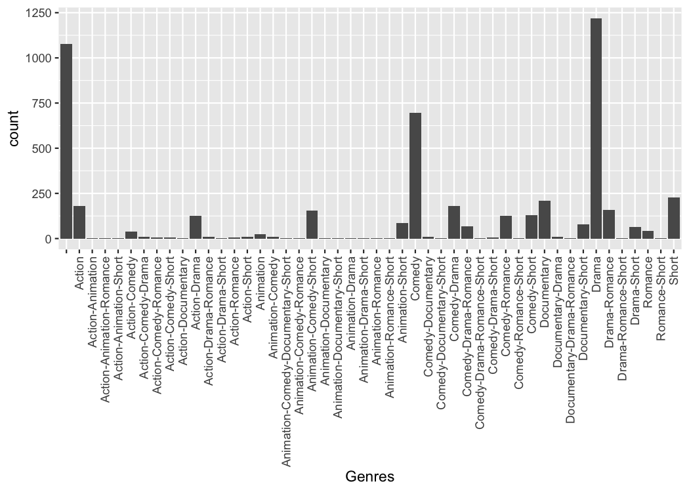

<!-- README.md is generated from README.Rmd. Please edit that file -->
ggupset
=======

Plot a combination matrix instead of the standard x-axis and create UpSet plots with ggplot2.


Installation
------------

You can install the released version of ggupset from [CRAN](https://CRAN.R-project.org) with:

``` r
# Download package from CRAN
install.packages("ggupset")

# Or get the latest version directly from GitHub
devtools::install_github("const-ae/ggupset")
```

Example
-------

This is a basic example which shows you how to solve a common problem:

``` r
# Load helper packages
library(ggplot2)
library(tidyverse)
#> ── Attaching packages ───────────────────────────────────────────────────────────────────────────────────────────────────────────────────── tidyverse 1.2.1 ──
#> ✔ tibble  1.4.2     ✔ purrr   0.2.5
#> ✔ tidyr   0.8.2     ✔ dplyr   0.7.8
#> ✔ readr   1.2.1     ✔ stringr 1.4.0
#> ✔ tibble  1.4.2     ✔ forcats 0.3.0
#> ── Conflicts ──────────────────────────────────────────────────────────────────────────────────────────────────────────────────────── tidyverse_conflicts() ──
#> ✖ dplyr::filter() masks stats::filter()
#> ✖ dplyr::lag()    masks stats::lag()

# Load my package
library(ggupset)
```

In the following I will work with a tidy version of the movies dataset from ggplot. It contains a list of all movies in IMDB, their release data and other general information on the movie. It also includes a `list` column that contains annotation to which genre a movie belongs (Action, Drama, Romance etc.)

``` r
tidy_movies
#> # A tibble: 50,000 x 10
#>    title  year length  budget rating votes mpaa  Genres stars
#>    <chr> <int>  <int>   <int>  <dbl> <int> <chr> <list> <dbl>
#>  1 Ei i…  1993     90      NA    8.4    15 ""    <chr …     1
#>  2 Hamo…  1985    109      NA    5.5    14 ""    <chr …     1
#>  3 Mind…  1963     99      NA    6.4    54 ""    <chr …     1
#>  4 Trop…  1998    119      NA    4.5    20 ""    <chr …     1
#>  5 Crys…  1995     85      NA    6.1    25 ""    <chr …     1
#>  6 Tota…  1991    102      NA    6.3   210 ""    <chr …     1
#>  7 Visi…  1995    100      NA    4.6     7 ""    <chr …     1
#>  8 Pang…  1976     85      NA    7.4     8 ""    <chr …     1
#>  9 Not …  1955    135 2000000    6.6   223 ""    <chr …     1
#> 10 Auto…  1994     87      NA    7.4     5 ""    <chr …     1
#> # ... with 49,990 more rows, and 1 more variable: percent_rating <dbl>
```

`ggupset` makes it easy to get an immediate impression how many movies are in each genre and their combination. For example there are slightly more than 1200 Dramas in the set, more than 1000 which don't belong to any genre and ~170 that are Comedy and Drama.

``` r
tidy_movies %>%
  distinct(title, year, length, .keep_all=TRUE) %>%
  ggplot(aes(x=Genres)) +
    geom_bar() +
    scale_x_upset(n_intersections = 20)
#> Warning: Removed 100 rows containing non-finite values (stat_count).
```


`scale_x_upset` is a neat function that does several things at once to create a useful x-axis. I will now step by step recreate the plot to demonstrate some of the underlying ideas.

The first important idea is to realize that a list column is just as good as a character vector with the list elements collapsed

``` r
tidy_movies %>%
  distinct(title, year, length, .keep_all=TRUE) %>%
  mutate(Genres_collapsed = sapply(Genres, function(x) paste0(sort(x), collapse = "-"))) %>%
  select(title, Genres, Genres_collapsed)
#> # A tibble: 5,000 x 3
#>    title                                   Genres    Genres_collapsed
#>    <chr>                                   <list>    <chr>           
#>  1 Ei ist eine geschissene Gottesgabe, Das <chr [1]> Documentary     
#>  2 Hamos sto aigaio                        <chr [1]> Comedy          
#>  3 Mind Benders, The                       <chr [0]> ""              
#>  4 Trop (peu) d'amour                      <chr [0]> ""              
#>  5 Crystania no densetsu                   <chr [1]> Animation       
#>  6 Totale!, La                             <chr [1]> Comedy          
#>  7 Visiblement je vous aime                <chr [0]> ""              
#>  8 Pang shen feng                          <chr [2]> Action-Animation
#>  9 Not as a Stranger                       <chr [1]> Drama           
#> 10 Autobiographia Dimionit                 <chr [1]> Drama           
#> # ... with 4,990 more rows
```

We can easily make a plot using the strings as categorical axis labels

``` r
tidy_movies %>%
  distinct(title, year, length, .keep_all=TRUE) %>%
  mutate(Genres_collapsed = sapply(Genres, function(x) paste0(sort(x), collapse = "-"))) %>%
  ggplot(aes(x=Genres_collapsed)) +
    geom_bar() +
    theme(axis.text.x = element_text(angle=90, hjust=1, vjust=0.5))
```


Because the process of collapsing list columns into delimited strings is fairly generic, I provide a new scale that does this automatically (`scale_x_mergelist()`).

``` r
tidy_movies %>%
  distinct(title, year, length, .keep_all=TRUE) %>%
  ggplot(aes(x=Genres)) +
    geom_bar() +
    scale_x_mergelist(sep = "-") +
    theme(axis.text.x = element_text(angle=90, hjust=1, vjust=0.5))
```


But the problem is that it can be difficult to read those labels. Instead I provide a third function that replaces the axis labels with a combination matrix (`axis_combmatrix()`).

``` r
tidy_movies %>%
  distinct(title, year, length, .keep_all=TRUE) %>%
  ggplot(aes(x=Genres)) +
    geom_bar() +
    scale_x_mergelist(sep = "-") +
    axis_combmatrix(sep = "-")
```


One thing that is only possible with the `scale_x_upset()` function is to automatically order the categories and genres by `freq` or by `degree`.

``` r
tidy_movies %>%
  distinct(title, year, length, .keep_all=TRUE) %>%
  ggplot(aes(x=Genres)) +
    geom_bar() +
    scale_x_upset(order_by = "degree")
#> Warning: Removed 1076 rows containing non-finite values (stat_count).
```


Styling
-------

To make publication ready plots, you often want to have complete control how each part of a plot looks. This is why I provide an easy way to style the combination matrix. Simply add a `theme_combmatrix()` to the plot.

``` r
tidy_movies %>%
  distinct(title, year, length, .keep_all=TRUE) %>%
  ggplot(aes(x=Genres)) +
    geom_bar() +
    scale_x_upset(order_by = "degree") +
    theme_combmatrix(combmatrix.panel.point.color.fill = "green",
                     combmatrix.panel.line.size = 0,
                     combmatrix.label.make_space = FALSE)
#> Warning: Removed 1076 rows containing non-finite values (stat_count).
```


Alternative Packages
--------------------

There is already a package called `UpSetR` ([GitHub](https://github.com/hms-dbmi/UpSetR), [CRAN](https://cran.r-project.org/package=UpSetR)) that provides very similar functionality and that heavily inspired me to write this package. It produces a similar plot with an additional view that shows the overall size of each genre.

``` r

# UpSetR
tidy_movies %>%
  distinct(title, year, length, .keep_all=TRUE) %>%
  unnest() %>%
  mutate(GenreMember=1) %>%
  spread(Genres, GenreMember, fill=0) %>%
  as.data.frame() %>%
  UpSetR::upset(sets = c("Action", "Romance", "Short", "Comedy", "Drama"), keep.order = TRUE)
```


``` r

# ggupset
tidy_movies %>%
  distinct(title, year, length, .keep_all=TRUE) %>%
  ggplot(aes(x=Genres)) +
    geom_bar() +
    scale_x_upset(order_by = "degree", n_sets = 5)
#> Warning: Removed 1311 rows containing non-finite values (stat_count).
```


The `UpSetR` package provides a lot convenient helpers around this kind of plot; the main advantage of my package is that it can be combined with any kind of ggplot that uses a categorical x-axis. This additional flexibility can be useful if you want to create non-standard plots. The following plot for example shows when movies of a certain genre were published.

``` r
tidy_movies %>%
  distinct(title, year, length, .keep_all=TRUE) %>%
  ggplot(aes(x=Genres, y=year)) +
    geom_violin() +
    scale_x_upset(order_by = "freq", n_intersections = 12)
#> Warning: Removed 513 rows containing non-finite values (stat_ydensity).
```


Advanced examples
=================

#### 1. Complex experimental design

The combination matrix axis can be used to show complex experimental designs, where each sample got a combination of different treatments.

``` r
df_complex_conditions
#> # A tibble: 360 x 4
#>    KO    DrugA Timepoint response
#>    <lgl> <chr>     <dbl>    <dbl>
#>  1 TRUE  Yes           8     84.3
#>  2 TRUE  Yes           8    105. 
#>  3 TRUE  Yes           8     79.1
#>  4 TRUE  Yes           8    140. 
#>  5 TRUE  Yes           8    108. 
#>  6 TRUE  Yes           8     79.5
#>  7 TRUE  Yes           8    112. 
#>  8 TRUE  Yes           8    118. 
#>  9 TRUE  Yes           8    114. 
#> 10 TRUE  Yes           8     92.4
#> # ... with 350 more rows

df_complex_conditions %>%
  mutate(Label = pmap(list(KO, DrugA, Timepoint), function(KO, DrugA, Timepoint){
    c(if(KO) "KO" else "WT", if(DrugA == "Yes") "Drug", paste0(Timepoint, "h"))
  })) %>%
  ggplot(aes(x=Label, y=response)) +
    geom_boxplot() +
    geom_jitter(aes(color=KO), width=0.1) +
    geom_smooth(method = "lm", aes(group = paste0(KO, "-", DrugA))) +
    scale_x_upset(order_by = "degree",
                  sets = c("KO", "WT", "Drug", "8h", "24h", "48h"),
                  position="top", name = "") +
    theme_combmatrix(combmatrix.label.text = element_text(size=12),
                     combmatrix.label.extra_spacing = 5)
```



#### 2. Aggregation of information

`dplyr` currently does not support list columns as grouping variables. In that case it makes sense to collapse it manually and use the `axis_combmatrix()` function to get a good looking plot.

``` r
# Percentage of votes for n stars for top 12 genres
avg_rating <- tidy_movies %>%
  mutate(Genres_collapsed = sapply(Genres, function(x) paste0(sort(x), collapse="-"))) %>%
  mutate(Genres_collapsed = fct_lump(fct_infreq(as.factor(Genres_collapsed)), n=12)) %>%
  group_by(stars, Genres_collapsed) %>%
  summarize(percent_rating = sum(votes * percent_rating)) %>%
  group_by(Genres_collapsed) %>%
  mutate(percent_rating = percent_rating / sum(percent_rating)) %>%
  arrange(Genres_collapsed)

avg_rating
#> # A tibble: 130 x 3
#> # Groups:   Genres_collapsed [13]
#>    stars Genres_collapsed percent_rating
#>    <dbl> <fct>                     <dbl>
#>  1     1 Drama                    0.0437
#>  2     2 Drama                    0.0411
#>  3     3 Drama                    0.0414
#>  4     4 Drama                    0.0433
#>  5     5 Drama                    0.0506
#>  6     6 Drama                    0.0717
#>  7     7 Drama                    0.129 
#>  8     8 Drama                    0.175 
#>  9     9 Drama                    0.170 
#> 10    10 Drama                    0.235 
#> # ... with 120 more rows

# Plot using the combination matrix axis
# the red lines indicate the average rating per genre
ggplot(avg_rating, aes(x=Genres_collapsed, y=stars, fill=percent_rating)) +
    geom_tile() +
    stat_summary_bin(aes(y=percent_rating * stars), fun.y = sum,  geom="point", 
                     shape="—", color="red", size=6) +
    axis_combmatrix(sep = "-", levels = c("Drama", "Comedy", "Short", 
                    "Documentary", "Action", "Romance", "Animation", "Other")) +
    scale_fill_viridis_c()
```


